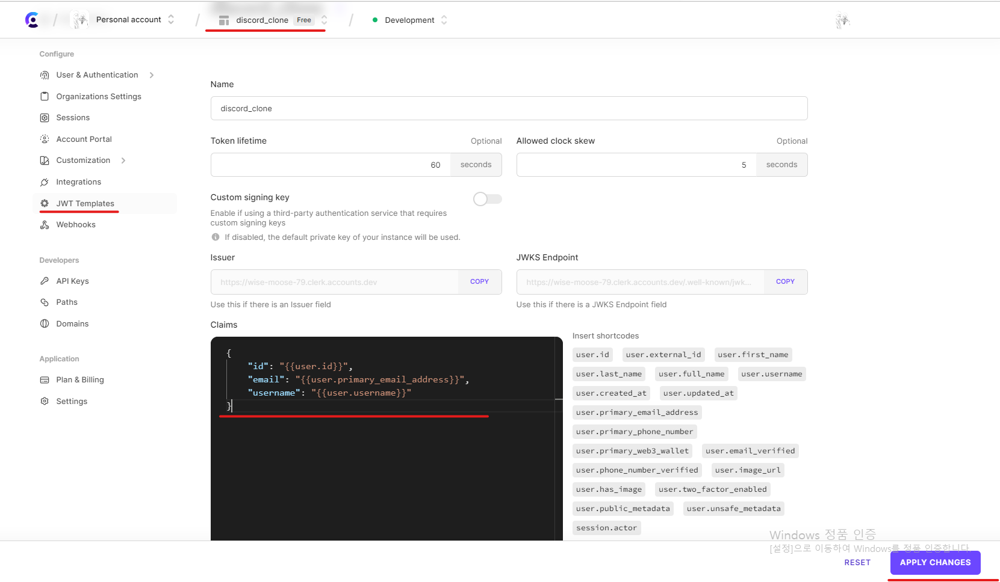

```
https://clerk.com/

클럭은 무료 인증 라이브러리이다.
회원 가입 후, 대시보드에서 어플리케이션 생성 버튼을 클릭 후 api 키를 받을 수 있다.

api 키 확인 후, 사이드 메뉴의 jwt 템플릿에서 blank로 새 템플릿 생성.
```



```
api 키는 .env에 작성하여 사용할 예정.

npm install @clerk/clerk-react
```

```
// .env

VITE_CLERK_PUBLISHABLE_KEY=pk_test_*********************************
```

```
https://shape-coding.tistory.com/entry/React-리액트에서-env-환경변수-사용하기

리액트와 바이트에서 환경 변수 사용법
```